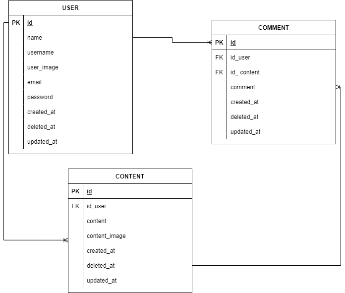

# Circle Apps


This is a golang rest api project group organized by Alterra Academy. This API is used to run Circle applications. This application has features as below.

### Build App & Database


# Features
## User:
- Register
- Login
- Logout
- Show profile
- Edit profile
- Search another users
- Deactive account

<div>
  
| Feature User | Endpoint | Param | JWT Token | Function |
| --- | --- | --- | --- | --- |
| POST | /register | - | NO | This is how users register their account. |
| POST | /login  | - | YES | This is how users log in.  |
| GET | /users | - | YES | Users obtain their account information in this form. |
| PUT | /users | - | YES | This is how users Update their profile. |
| GET | /users/search | - | YES | This is how users Search another users. |
| DELETE | /users | - | YES | This is how users Delete their profile. |
| GET | /logout | - | YES | This is how users log out. |


</details>

<div>

## Content :
- Show all content
- Show detail content
- Add content
- Edit content
- Delete content

## Comment :
- Add comment
- Delete comment

# ERD


# API Documentations

[Click here](https://app.swaggerhub.com/apis-docs/icxz1/SosmedAPI/1.0.0#/) to see documentations.


## How to Install To Your Local

- Clone it

```
$ git clone https://github.com/icxz1/SosmedGroup.git
```

- Go to directory

```
$ cd SosmedGroup
```

## Authors 👑

-   Fauzi Sofyan  [](https://github.com/fauzilax)

-  Alfian Aditya [](https://github.com/icxz1)

 <p align="right">(<a href="#top">back to top</a>)</p>
<h3>
<p align="center">:copyright: January 2023 </p>
</h3>
<!-- end -->
<!-- comment -->
